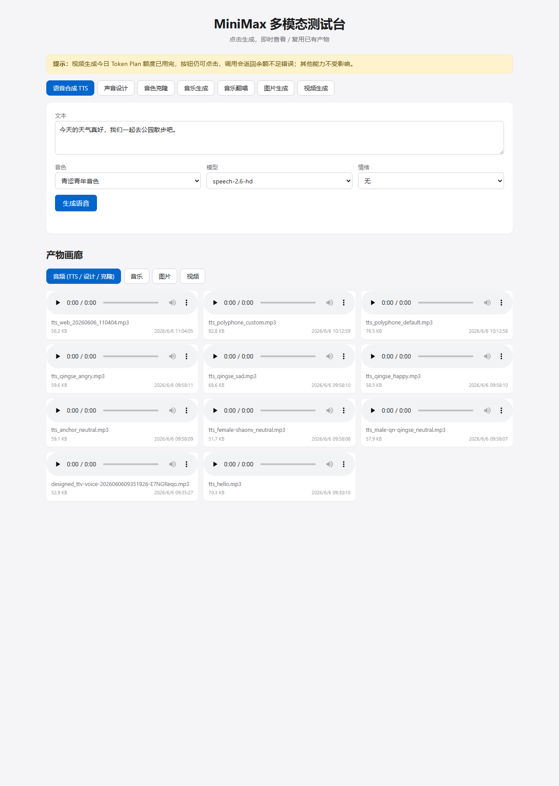
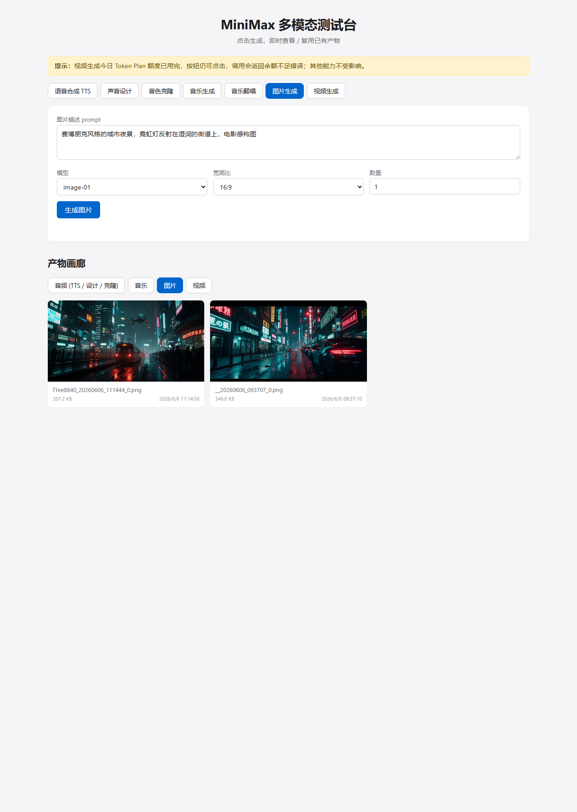
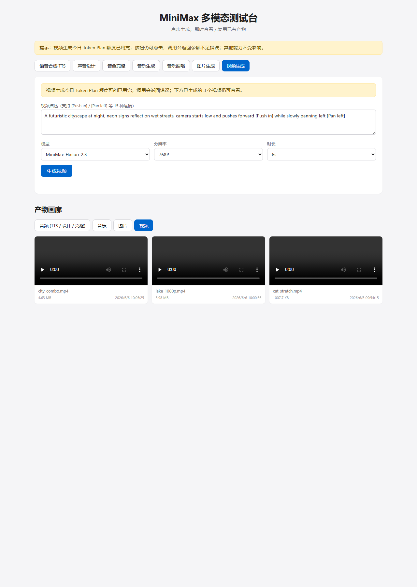
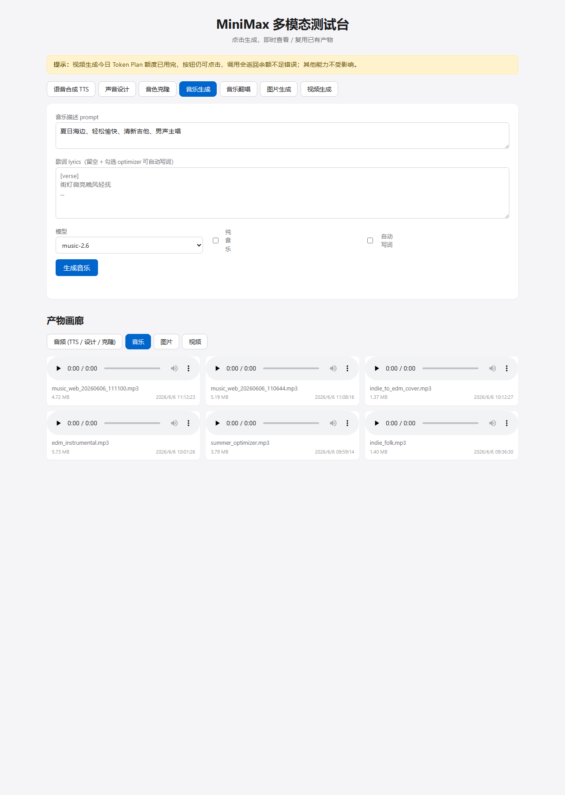

# minimax-testbench

> 可视化测试台 + Python 模块库，用于 [MiniMax 开放平台](https://platform.minimaxi.com/) 的多模态 API：TTS、声音设计、音色克隆、音乐生成、音乐翻唱、图片生成、视频生成。

[](https://www.python.org/)
[](./LICENSE)
[](https://platform.minimaxi.com/)

## 📸 截图

| 语音合成 TTS | 图片生成 |
| --- | --- |
|  |  |

| 视频生成 | 音乐生成 |
| --- | --- |
|  |  |

## ✨ 特性

- **6 大能力一站式覆盖** — TTS / 声音设计 / 音色克隆 / 音乐 / 图片 / 视频
- **Web UI 即开即用** — Flask 后端 + 原生前端，点击生成、即时查看、复用已有产物
- **Python 模块库** — 每个能力一个模块，可作为 SDK 集成到自己的项目
- **真实踩坑沉淀** — 端点路径、OSS 预签名 URL、翻唱 prompt 限制等全部整理在 [REPORT.md](./REPORT.md)
- **零额外依赖** — 只需 `requests` / `python-dotenv` / `Pillow` / `Flask`

## 🚀 快速开始

### 1. 准备 API Key

前往 [MiniMax 账户管理](https://platform.minimaxi.com/user-center/basic-information/interface-key) 获取 API Key（支持 Token Plan 订阅 Key 或按量计费 Key）。

### 2. 安装

```bash
git clone https://github.com/<your-username>/minimax-testbench.git
cd minimax-testbench
pip install -r requirements.txt
```

### 3. 配置

```bash
cp .env.example .env
# 编辑 .env，填入你的 API Key
```

### 4. 启动 Web UI

```bash
python app.py
```

打开 [http://127.0.0.1:5001/](http://127.0.0.1:5001/) 即可使用。

### 5. 或运行 CLI 脚本

```bash
python tests/test_tts.py            # TTS
python tests/test_voice_design.py   # 声音设计
python tests/test_music.py          # 音乐
python tests/test_image.py          # 图片
python tests/test_video.py          # 视频
```

## 🧩 项目结构

```
minimax-testbench/
├── app.py                  # Flask Web 服务（端口 5001）
├── config.py               # 环境变量加载
├── minimax_client.py       # 统一 API 客户端
├── modules/                # 各能力封装（可作为 SDK 引用）
│   ├── tts.py
│   ├── voice_design.py
│   ├── voice_clone.py
│   ├── music.py
│   ├── image.py
│   └── video.py
├── tests/                  # CLI 测试脚本（11 个）
├── templates/index.html    # Web UI
├── static/                 # CSS / JS
├── output/                 # 生成的产物（被 .gitignore 忽略）
├── samples/                # 参考音频（被 .gitignore 忽略）
├── .env.example
├── requirements.txt
├── README.md
├── REPORT.md               # 真实测试结果 + 踩坑点
└── LICENSE                 # MIT
```

## 📚 API 端点速查

完整端点、参数、响应结构见 [REPORT.md](./REPORT.md#2-各能力详细结果)，这里只列路径：

| 能力 | 端点 | 备注 |
| --- | --- | --- |
| TTS 同步 | `POST /v1/t2a_v2` | 303 个系统音色 + 9 种情绪 |
| 声音设计 | `POST /v1/voice_design` | 自然语言生成 voice_id |
| 音色克隆 | `POST /v1/voice_clone` | 需先 `/v1/files/upload` |
| 音乐生成 | `POST /v1/music_generation` | 支持 `music-2.6` / `music-cover` |
| 图片生成 | `POST /v1/image_generation` | 8 种宽高比，最多 9 张/次 |
| 视频生成 | `POST /v1/video_generation` | 异步任务；查询 `GET /v1/query/video_generation`；下载 `GET /v1/files/retrieve` |
| 音色列表 | `POST /v1/get_voice` | 需传入 `voice_type` |
| 文件上传 | `POST /v1/files/upload` | multipart/form-data |

## 🐍 作为 SDK 使用

```python
from modules import text_to_speech, generate_image, generate_music, generate_video

# TTS
text_to_speech("你好世界", output_path="hello.mp3")

# 图片
generate_image("赛博朋克城市夜景", output_dir="./imgs", aspect_ratio="16:9")

# 音乐
generate_music("Lo-Fi 放松氛围", output_path="./lofi.mp3")

# 视频（异步，等待完成）
generate_video("一只橘猫伸懒腰", output_path="./cat.mp4")
```

## ⚠️ 已知问题与限制

1. **音色克隆需单独开通** — 默认 Token Plan 账号返回 `2038: voice clone user forbidden`，需在控制台申请 KYC
2. **音乐翻唱 prompt 必须英文** — 中文 prompt 会让请求卡到 5 分钟超时
3. **视频生成耗时长** — 单条 1~3 分钟，受 5h 窗口额度限制
4. **OSS 预签名 URL 不能带 Bearer** — 客户端已处理，但自定义下载时需要注意

更多细节见 [REPORT.md](./REPORT.md#3-关键发现与踩坑点)。

## 🔑 安全提示

- **永远不要把 `.env` 提交到 git** — 本项目已通过 `.gitignore` 排除
- API Key 一旦泄露请立即在 [账户管理](https://platform.minimaxi.com/user-center/basic-information/interface-key) 重置
- 生成的产物文件存放在 `output/`，默认也不会被 git 追踪

## 🤝 贡献

欢迎 PR 和 Issue。提 PR 前请确保：

- 你的改动对应一个或多个新能力 / 已有能力的优化
- 附带 `tests/` 下的可运行测试脚本
- 在 [REPORT.md](./REPORT.md) 记录任何新发现的踩坑点

## 📄 许可证

[MIT](./LICENSE) — 2026 minimax-testbench contributors
